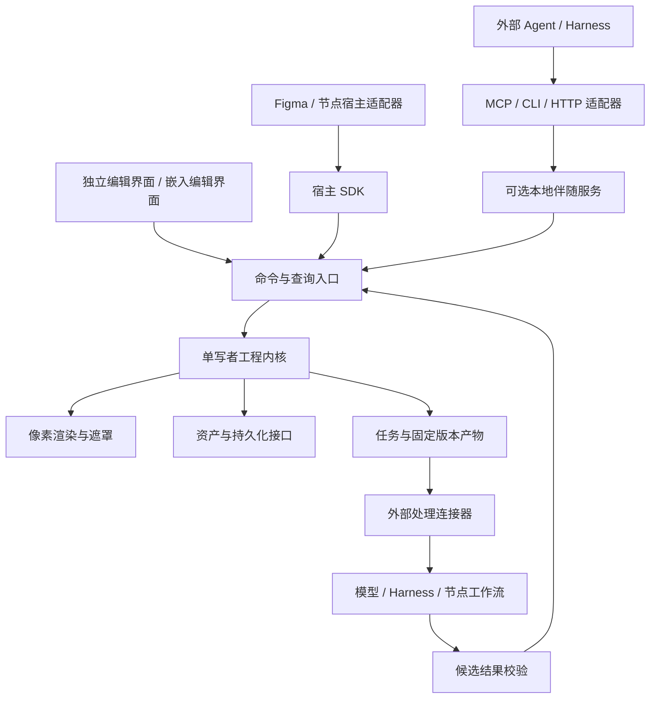

# lite ps 架构与接入契约 v0.1

日期：2026-09-20。状态：设计建议，未实现，未进行性能验证。用户已纠正定位为 Photopea 类在线 PS、Compositor UI 风格；具体编辑内核、图层类型与文件格式需按功能/PSD 目标重新评审。产品范围见 [PRD](./PRD-v0.1.md)。本文中的名称与结构用于评审，不代表已经发布的 SDK。

## 1. 架构结论

采用一个编辑内核、一个权威工程状态、多种接入方式。应用作为模块化单体交付；不拆微服务，不提前实现通用插件平台。

用户已纠正：核心是可独立使用的在线 PS，Photopea 为成熟编辑产品参照，Compositor 为 UI 风格参照。首条验收不依赖任何宿主或 Agent。A/B/C 需求及 TapNow/LightAI 的使用背景保留，作为扩展适配；此前将宿主往返作为产品首发前提的安排撤回。

工程模型、统一命令、持久化与渲染一致性的原则继续适用。当前模型偏重位图合成；文字、基础形状、分组、PSD/智能对象等需求冻结后，应补充对应模型与渲染能力，再决定 Fabric/Konva/Canvas 2D 是否合适。不能把本稿的 RasterLayer 最小模型当作已经足以实现 Photopea 类编辑器的结论。



图中是职责和调用关系，不代表每个框都是服务进程。最初保持 5 个深模块：工程内核、像素引擎、资产持久化、任务交付、接入适配。UI 是消费者。

## 2. 运行形态与权威状态

| 形态 | 编辑内核运行位置 | 持久化与通信 | 约束 |
|---|---|---|---|
| 独立 Web | 浏览器编辑会话，重运算优先 Worker | 浏览器存储、自包含工程导入导出、SDK | 不具备任意本地目录监听能力 |
| Web + 本地服务 | 同一浏览器内核；本地服务负责路由和存储 | 本地磁盘、MCP/CLI/HTTP、事件连接 | 浏览器关闭时返回需打开编辑会话的状态 |
| 嵌入 | iframe 中的同一编辑内核 | 宿主 SDK 与存储适配器 | 宿主提供已约定的素材和交付路径 |
| 后续桌面封装 | 复用同一内核与界面 | 桌面宿主提供文件系统与生命周期 | 是否使用 Tauri/Electron 根据平台测试决定 |

**R1 每个工程只允许一个写会话。** 本地服务不是第二套文档编辑状态机；它保存已提交状态并转发命令。内核通过 StoragePort 写入成功后才宣布命令已持久化。连接模式下 StoragePort 使用本地服务；纯 Web 模式使用浏览器存储。

本地服务为写会话分配租约及递增的 sessionEpoch，保存时比较 epoch 与期望 revision，拒绝过期会话。第二个窗口默认只读，可显式接管；纯 Web 同源多窗口使用互斥机制达到相同目标。

连接断开时保留未提交手势预览，停止接收新的远程修改和宣称保存成功。用户可以重连，或另存为新的本地工程副本继续编辑。R1 不做两个离线分支自动合并。这样避免浏览器与本地服务各自修改同一工程。

导出和像素操作依赖可用编辑会话；无会话时返回 `REQUIRES_EDITOR`，也可创建带过期时间的等待任务。不能把“启动了本地服务”表述成“完整无界面渲染服务已可用”。

## 3. 工程模型：不绑定画布库

| 对象 | 主要信息 | 约束 |
|---|---|---|
| Document | ID、schemaVersion、revision、画布尺寸、颜色策略、图层顺序、选区/重绘通道引用 | 工程状态唯一来源，revision 单调递增 |
| RasterLayer | 稳定 ID、名称、assetId、transform、opacity、blendMode、visibility、locked、maskId、adjustments、provenance | 图层顺序单独定义；不以数组下标当 ID |
| Asset | 内容哈希、媒体类型、字节长度、解码尺寸、归一化资产引用、原始资源引用 | 原始素材不可变，不把 Base64 放进工程树 |
| LayerMask | 灰度像素、尺寸、assetId、与图层的坐标关系 | R1 与图层一起变换；黑隐藏、白显示 |
| Selection | 文档空间覆盖度、构造方式、羽化参数 | 用于限制编辑；单独保存，不自动作为模型输入 |
| InpaintRegion | 文档空间灰度覆盖度、语义、版本 | 内部白色代表待编辑，输出适配器可转换极性 |
| Adjustment | 有序的亮度/对比度/饱和度参数及算法版本 | 不原地改源图，渲染顺序固定 |
| Checkpoint | 不可变工程快照、资源引用、来源操作 | 用于回退和任务输入，不等同无限历史 |
| Task / Submission | 任务 ID、尝试 ID、输入版本、状态、产物引用 | 每次提交固定版本，结果不可覆盖 |
| WorkspaceState | 当前工具、选中图层、视口、面板状态 | 可单独恢复，不影响合成结果和工程 revision |

provenance 可记录源应用、原节点标识、输入版本、任务 ID、模型/工作流标识、种子和参数（有才记录），不存访问令牌。图片来源文字只作为数据展示，不作为执行指令。

图层组、文字与基础形状的首发范围待按在线 PS 的真实任务冻结；PSD 特性支持须逐项声明。新版本遇到不支持的必要特性时明确拒绝可写打开或提供明确的转换选项，不能静默丢弃未知内容。

## 4. 坐标、Alpha 与三类遮罩

### 4.1 坐标约定

- 文档原点为左上，x 向右、y 向下，单位为文档像素；尺寸为正整数。
- 图层本地坐标基于经 EXIF 方向归一化后的素材；位置和变换允许小数。
- 持久化以仿射矩阵为准：`x' = a*x + c*y + e`，`y' = b*x + d*y + f`。旋转/缩放参数是 UI 表达，不与矩阵各存一份互相矛盾的真值。
- 视口矩阵只负责显示；DPR 只影响显示缓冲。导出创建明确宽高的离屏目标。
- 指针从视口反变换到文档；编辑图层蒙版时，再反变换到图层本地坐标。遇到不可逆矩阵拒绝提交。
- 笔刷大小定义为文档像素直径；作用于非等比缩放图层时按完整逆矩阵映射笔刷形状，不能只除以一个 scale。
- 翻转允许矩阵负缩放；渲染顺序、命中检测和导出必须一致。图层外像素裁切于文档边界，原资产不因此删除。

### 4.2 遮罩分离

| 类型 | 作用 | 坐标 | 用户看见什么 |
|---|---|---|---|
| 图层蒙版 | 改变该图层可见度 | 图层本地 | 素材被隐藏/恢复，蒙版缩略图 |
| 当前选区 | 限制下一次操作范围 | 文档 | 边界提示及可选覆盖预览 |
| 重绘区域 | 定义发给模型的处理区域 | 文档，任务中冻结 | 红色覆盖预览及明确发送范围 |

选区可以通过显式操作转换为重绘区域或图层蒙版；不是共用一个随时被覆盖的变量。红色覆盖属于 UI，不参与最终合成。

图层 Alpha、蒙版覆盖度和图层 opacity 相乘得到可见度；不得重复预乘。内部颜色/Alpha 编码约定由 RendererPort 统一，渲染后端之间的转换必须测试透明边缘。

遮罩导出以 profile 表达：`binary` / `grayscale` / 目标专用 Alpha 编码；携带 `polarity`、`threshold`、`featherPx`、`coordinateSpace` 和目标尺寸。二值 profile 在完成所有缩放、羽化与重采样后执行阈值，再编码不透明 PNG；默认阈值建议为 0.5，可在任务中显式指定。

不存在“所有模型遇到灰度都会异常”的通用规则。ComfyUI 的 MASK 支持不同覆盖度，LoadImage 的 MASK 又来自反转 Alpha；连接器须明确读取 RGB 灰度还是 Alpha，做专用转换。[官方数据类型说明](https://docs.comfy.org/custom-nodes/backend/images_and_masks/)

## 5. 渲染路线与技术选型门槛

建议 TypeScript + React，像素引擎与 React 隔离。Canvas 2D 作为第一个验证实现；渲染接口负责合成快照、生成缩略图和导出，不暴露 UI 对象。

每层建议处理顺序：已归一化素材 → 图层有序调整 → 图层蒙版 → 文档空间变换 → 图层 opacity 与 blend → 累积合成。视口叠加选中框、选区线和红色遮罩属于最后独立步骤。`normal` 在 Canvas 后端映射为 `source-over`。

R1 目标为 sRGB、8-bit RGBA、屏幕图像交付。导入明确转换到约定工作色彩空间并保存来源信息；浏览器后端不能正确处理的格式或色彩配置应提示转换/不支持。混合与调整以版本化参考样张为准，不宣称与 Photoshop 所有色彩设置像素完全一致。

| 候选 | 可借用的能力 | 本方案中的边界 |
|---|---|---|
| Fabric.js | 对象交互、选择、变换控件、图像处理接口 | 不把 Fabric JSON 作为工程协议；是否采用需验证非破坏蒙版及导出一致性 |
| Konva | 场景交互、命中检测、变换控件 | 逻辑图层不能简单一层对应一个 DOM Canvas 来实现跨图层混合 |
| miniPaint | 已有编辑流程和工具实现参考 | 先看内核耦合、可维护性与改造成本，再决定是否复用 |
| 自有 Canvas 2D 合成模块 | 明确像素管线与统一导出 | 控制范围；不顺手从零实现整套绘图框架 |

Fabric 官方提供变换、控件和过滤后端文档；Konva 官方说明其 Layer 各有一个 Canvas，并有额外性能开销；miniPaint 本身已经是完整浏览器编辑器。因此三者不能按“任挑一个库”视作等价方案。[Fabric 文档](https://www.fabricjs.com/docs/)、[Konva 性能说明](https://konvajs.org/docs/performance/All_Performance_Tips.html)、[miniPaint 仓库](https://github.com/viliusle/miniPaint)

建议先用同一组样张验证一种最合适的方案，遇到明确失败再比较候选。通过条件：8 种混合模式、旋转软蒙版、透明边缘、非破坏调整、2048/4096 导出、资源释放与 Worker 可用性。若需要 GPU，以同一 RendererPort 替换后端，不同时维护两个不同的“正确结果”。GPU 加速引入后保留参考样张与降级路径。

渲染可以独立于 UI，但 R1 不承诺所有环境都有 OffscreenCanvas 或所有绘图库都能直接搬进 Worker；功能检测失败时使用有调度的主线程后端。

## 6. 命令、事务、并发与撤销

### 6.1 一条命令的生命周期

鉴权与作用域 → 格式/能力校验 → 幂等检查 → expectedRevision 检查 → 暂存修改 → 资源与状态持久化 → 发布新 revision 和事件。任一步失败都不暴露半次事务。

同一 commandId 加同一参数摘要的重试返回原结果；同一 ID 配不同参数返回 `IDEMPOTENCY_KEY_REUSED`。去重信息与提交记录一起持久化，不能刷新后就忘记。

远程修改必须指定 expectedRevision。R1 使用保守的工程级冲突检测；冲突后调用方重新读取并决定，不能自动把旧命令套到新图层上。锁定图层对 UI 和 Agent 都生效，解锁必须是一条明确命令。

鼠标拖动和笔刷预览是临时状态，手势结束一次提交。手势期间外部写入返回 `BUSY` 及可重试提示，或进入有期限的串行队列；不插入一半笔画中间。UI 可预览，保存状态直到持久化确认才变为成功。

Agent 批处理全有或全无，一次批处理对应一条历史。撤销/重做作为新的版本化操作执行，不使 revision 倒退。R1 使用全局线性历史，UI 标明操作者，避免误以为撤销永远只作用于自己。

### 6.2 最小命令面

| 能力 | 建议操作 | 返回结果 |
|---|---|---|
| 探测 | capabilities、session.get | API/schema 版本、功能列表、限制和会话状态 |
| 工程 | document.create/open/get、checkpoint.create | 工程摘要、revision、资源需求 |
| 素材 | asset.import/get | 资产 ID、类型、尺寸、可读取引用 |
| 修改 | transaction.apply | 新 revision、修改摘要、历史条目 ID |
| 图层操作 | transaction 中的 add/remove/duplicate/replace/transform/reorder/setProperties | 同一事务返回，不逐个产生不同完成语义 |
| 蒙版选区 | transaction 中的 mask/selection 操作 | 坐标约定、受影响对象与范围 |
| 观察 | preview.get、layer.preview、events.subscribe | 图像引用/受限缩略图与对应 revision |
| 历史 | history.undo/redo | 新 revision 与恢复结果 |
| 人工处理 | task.requestUserEdit | taskId、打开编辑器的入口、期限 |
| 交付 | submission.create/get | jobId 或不可变产物清单 |
| 外部处理 | job.start/get/cancel、result.import | 输入版本、任务状态、候选引用 |

Agent 应同时得到结构信息和图像预览。例如查询返回图层名称、锁定状态、包围框、素材尺寸，预览返回合成图及相同 revision。不能仅提供 JSON 后声称 Agent 已能判断画面效果。

`window.__LIGHT_PS__` 仅包装异步 SDK，并提供 ready Promise、命令执行、状态和事件；不暴露内部 Canvas 对象或任意脚本执行。旧版 `isCompleted()` 若保留，只能针对明确任务，不能挂一个跨任务布尔值。

## 7. 双向接入：不要把所有事情塞进 MCP

### 7.1 Agent → 编辑器

- MCP server：让支持 MCP 的 harness 发现工具、读取资源与执行命令。采用本地 stdio 还是远程 HTTP，由首个真实 harness 的能力决定。
- CLI：适合终端 Agent 和脚本，标准输出仅返回结构化结果，退出码反映成功/失败。
- 本地 HTTP：其他语言客户端及进程调用；事件连接用于状态更新，不将“收到 WebSocket 消息”作为持久化证据。
- 浏览器 SDK：同页应用调用；跨页宿主通过消息桥接相同命令。

“兼容 MCP”是降低接入成本，不代表任何 Agent 零配置。认证、客户端支持、工具 schema、图片读取方式和可用能力仍需协商。MCP 传输与业务协议分别版本化，使用正式 SDK 并冻结支持矩阵，不从某个版本的示例复制全部生命周期规则。[MCP 2025-11-25 传输规范参考](https://modelcontextprotocol.io/specification/2025-11-25/basic/transports)

远程云端 Agent 不能直接访问用户电脑的 localhost。若首个宿主/Agent 使用云端接口，可由 Web 后端提供授权、命令转发与任务状态；若需要本机文件和进程能力，则使用已存在的宿主服务或可选本地连接组件。它们均对接单写者内核，不能因增加后端而出现第二份可独立修改的工程真值。网页或 Figma 沙箱访问本地服务还需验证宿主网络策略，连接失败时可提供工程包/产物交换作为恢复手段，不能以此替代正式集成。

### 7.2 编辑器 → 外部 Agent/工作流

连接器公开它支持的输入、遮罩类型、尺寸、输出、取消能力和状态查询。统一入口是提交一个 JobSpec、获取状态、接收结果；内部可调用模型 HTTP API、已配置的本地程序或 ComfyUI 工作流。

R1 不接受任意文本拼成 shell 命令来执行。连接器由用户配置已知目标；密钥留在本地服务或宿主凭据设施，不写入工程或 iframe。需要聊天式代理能力时，由对应 harness 适配器实现，不在图像内核再造聊天系统。

最小 JobSpec 包含：任务 ID、尝试 ID、操作类型、输入 snapshot/revision、图片/遮罩资产、目标能力、提示文本、尺寸和坐标映射、返回策略、期限。输入冻结后，用户对工程的后续修改不再改变本次请求。

## 8. 任务状态与不可变交付

工程是否可编辑、任务是否完成、产物是否送达是三种独立状态。

- 编辑会话：loading / ready / busy / disconnected / error。
- 任务：queued / running / awaiting_user / succeeded / failed / cancelled / timed_out。
- 提交交付：pending / delivered / acknowledged / delivery_failed。

Task 记录 kind、taskId、attemptId、时间戳、截止时间、输入快照及产物；重试创建新的 attemptId，保留前次记录。用户编辑任务可以从 queued 进入 awaiting_user，再生成产物。外部运行任务在收到合格候选后 succeeded，不表示用户已经接收候选图层。

提交时冻结 snapshot。导出针对该 snapshot 生成合成图、遮罩和工程包；全部验证、持久化后再发布清单。用户同时产生的新编辑属于更高 revision，与本次产物不混用。

示例产物清单（协议草案，非已实现接口）：

```json
{
  "schemaVersion": "1.0",
  "submissionId": "sub_example_01",
  "taskId": "task_example_01",
  "attemptId": "attempt_01",
  "documentId": "doc_example_01",
  "revision": 42,
  "status": "succeeded",
  "canvas": { "width": 2048, "height": 2048, "colorSpace": "srgb" },
  "maskProfile": { "encoding": "binary", "polarity": "white-is-edit", "threshold": 0.5 },
  "artifacts": [
    { "role": "composite", "assetId": "asset_composite", "mediaType": "image/png" },
    { "role": "mask", "assetId": "asset_mask", "mediaType": "image/png" },
    { "role": "project", "assetId": "asset_project", "mediaType": "application/zip" }
  ]
}
```

实际清单还必须包含每个产物的内容哈希、字节数、创建时间及适配传输的读取引用。示例 ID 不作为哈希使用。

事件包含 eventId、sessionEpoch、documentId、revision、taskId/commandId 和事件类型。重连从 cursor 续读；超出保留窗口则返回需重取快照。事件只用于通知，可靠状态可随时查询。

取消要求被接受与底层任务停止分开表达；不支持硬取消的连接器标记“已取消接收结果”。晚到结果可保留在记录中，不能自动修改工程。

## 9. 图像回贴与版本冲突

全画布模式的输入输出尺寸必须一致。返回尺寸不匹配时标为待处理候选，不默认拉伸。

后续 ROI 模式需要记录：输入 documentId/revision、文档内裁切矩形、上下文 padding、模型处理尺寸、等比缩放与补边、遮罩转换、返回结果到文档的矩阵。原始选区和模型用扩张区域分开保存。

例如，文档内 400×300 的区域要送到 512×512 模型，可能使用等比缩放后补边；输出返回时先去补边再逆映射，不能把 512×512 直接铺到 400×300。回贴使用冻结的原始/羽化混合区域，不能误用扩张后的模型生成范围覆盖更多内容。

输入 revision 与当前版本不同，默认只展示候选和来源。用户明确接收时创建新图层或指定替换，保留原图；如果相关对象被删除或坐标关系失效，报告冲突并提供插入新图层，不猜测绑定对象。

## 10. 文件交换与工程保存

### 10.1 自包含工程包

建议工程包使用带 schemaVersion 的清单、素材资产、蒙版资产和缩略预览；默认包含继续编辑所需的全部资源。外链只能作为来源记录，不能成为几年后打不开工程的唯一素材地址。

自动保存用事务化增量与周期检查点，不在每笔结束重新压缩整个工程。显式“另存工程包”再生成可携带归档。新格式迁移先写新副本，原包可回退。

纯 Web：浏览器存储作为恢复缓存，显式工程包用于用户可见的备份。OPFS 对页面来源私有，不能当作外部 Agent 都能访问的共享目录；也受配额限制。[OPFS 说明](https://developer.mozilla.org/en-US/docs/Web/API/File_System_API/Origin_private_file_system)

本地服务：目录中保存不可变资产、工程检查点和有界操作日志；断电/进程终止测试验证最后一次确认保存。写临时文件、flush/fsync 与同文件系统原子改名的策略按目标系统实现并测试，不能用文件出现就认定完整。

### 10.2 文件工作区兼容适配

文件通道是兼容入口，不是主状态源。按任务隔离，例如 inbox 中每个 taskId 一份输入包，outbox 中每个 submissionId 一份不可变产物。

输入：先写素材与任务临时清单，最后原子发布 ready 清单。监听目录而非只盯固定文件；启动和重连时重扫；用任务 ID、内容摘要去重。校验完整后才导入，导入失败保留可诊断状态。

输出：先写并校验全部产物，再发布 completed 清单。消费者只读取清单列出的本次 submission 文件并校验，不能看到旧 status.json 就认为新任务成功。

fs.watch 事件可能丢失、重复或因文件替换失效；可靠性来自清单、扫描、去重与持久状态，不来自监听器保证。Node 官方文档说明了跨平台差异、网络文件系统限制和 inode 行为。[Node 文件监听 caveats](https://nodejs.org/api/fs.html#caveats)

## 11. 嵌入、Figma 与节点适配

### 11.1 iframe / SDK

首次握手协商协议版本、能力、限制、sessionNonce 和资源通道；校验 source window 与允许 origin 后建立消息通道。所有请求有 requestId、超时和结构化错误。普通网页明确指定 targetOrigin；无法使用普通 origin 判断的宿主沙箱由专用适配器校验宿主来源和会话，不泛化为接受任意 `*` 消息。[postMessage 说明](https://developer.mozilla.org/en-US/docs/Web/API/Window/postMessage)

同源组件复用 SDK，但不直接访问内核私有状态。嵌入存储优先由宿主通过 StoragePort 明确提供，避免假设第三方 iframe 的本地存储与独立页面相同或持久可用。

只在拥有焦点/手势时接管快捷键和滚轮。iframe 内部 DOM 事件本就不会按普通父子 DOM 向宿主页冒泡；同页组件则需要宿主协议和选择性事件处理，不能只写一条“阻断所有事件”。

### 11.2 Figma

插件主线程负责读取当前选择和写入文档，插件 UI/编辑器处理图像。支持两种导入：取原图片字节，或把所选节点渲染成位图；两者 UI 明确区分，因为后者包含裁切、效果和其他内容。

导出选区时记录文件/节点标识、导出边界、缩放、变换与目标填充位置。回写前检查目标是否仍存在，以及相关属性是否与导出时一致；默认插入新图片，替换作为明确操作。重试以 submissionId 与节点附加元数据去重。

Figma 图片尺寸、媒体格式和网络能力按 Plugin API 限制探测，不允许超限自动降质后不提示。插件关闭后不假定它仍在监听本地端口；需要恢复连接并核对待交付任务。

官方示例包含 UI 消息传递、读取图片字节、创建图片并更新 fill；这些是接入路径依据，并不是“任意 Figma 工程能无损互转”的依据。[Figma 图片流程](https://developers.figma.com/docs/plugins/working-with-images/)

### 11.3 节点宿主

节点保存 documentRef、已提交 submissionId 和输入指纹。用户编辑期间仅更新预览；明确提交产生新的输出版本。下游从该版本的合成图、遮罩和元数据读取，不从“当前 UI 状态”取数。

R1/R2 不默认通过阻塞 GPU 运行队列等待用户作画。先把人工编辑作为任务准备步骤，提交后再运行下游；确需运行中人工检查的宿主，单独实现其调度协议并测试取消/恢复。输入变化标记 stale，不能静默替换正在编辑的工程。

### 11.4 TapNow / LightAI 接入事实与待验证项

截至 2026-09-20，本次仅进行了公开文档与工作区既有资料核对，未调用生成服务，未登录或修改用户画布。

| 对象 | 已见证据 | 仍不能据此承诺 |
|---|---|---|
| TapNow | 官方画布说明包含上传素材成为节点；Apps 说明描述创作与外部工具连接 | 第三方开发者可自行发布编辑器 App、读取用户选中节点、嵌入自定义 UI 或回写指定节点 |
| LightAI | 工作区既有接口资料包含图像生成/编辑、抠图、资产上传下载和异步任务查询 | 修改现有画布、创建/替换节点或在其页面嵌入第三方编辑器 |

来源：[TapNow 画布说明](https://docs.tapnow.ai/en/docs/canvas/explore-the-canvas)、[TapNow Apps 使用说明](https://docs.tapnow.ai/zh/docs/agent/apps)、[工作区 LightAI 接口资料](../../../shared/skills/lightai-skill/SKILL.md)。未发现公开开发文档不等于确认平台没有此能力；需要进一步核对当前账号可用入口或官方开发接口。

接入验证分开检查：取得所选素材、唤起编辑会话、回传图片到明确目标、保存可再次编辑的工程引用。生成 API 只覆盖其中部分处理能力。

优先考虑官方接口/扩展机制；平台允许的情况下可使用独立编辑窗口并通过授权桥接往返。浏览器扩展是另一个待评估方案，需要安装和站点适配，稳定性不能先行保证。通用复制粘贴、下载上传可作为可用性基线或恢复路径；是否满足首发体验须经用户对齐。桌面封装本身不会增加第三方平台的开放接口。

## 12. 性能、历史与资源预算

一张 4096×4096 RGBA8 原始缓冲约 64 MiB，10 张约 640 MiB，尚未计算蒙版、纹理、合成中间结果与历史。因此“最多 10 层”和“20 步撤销”都不是内存安全保证。

建议逐步实现：

1. 以源素材尺寸计算准入；加载后按需解码、缓存缩略图，及时关闭 ImageBitmap 和释放对象 URL。
2. 属性修改保存命令前后值；笔刷蒙版保存受影响区域/块的前后数据，一次手势一个事务。
3. 历史以字节预算为主、步数为辅；大操作先持久化检查点，不能无提示丢掉刚刚承诺可撤销的修改。
4. 重复源素材共用不可变资产，图层副本只新增参数/蒙版；缓存键包含 assetHash、调整和蒙版版本。
5. 预览可降采样，但导出使用原尺寸。视口移动不触发整工程重新解码。
6. 先验证全帧实现与缓存；只有测得瓶颈后才引入复杂分块渲染、GPU 或 WASM。

撤销记录与崩溃恢复日志有不同保留策略。R1 承诺重开后工程可继续编辑，不承诺无限保存所有撤销步骤；文档 UI 明确显示恢复检查点。

## 13. 本地连接的最小安全边界

本地服务默认仅监听 loopback，校验 Host/Origin，使用每次安装/配对的访问凭据及工程作用域。普通本地 UI 同源访问；不能把 `Access-Control-Allow-Origin: *` 当作默认 Agent 接入方案。

文件访问限制在用户绑定的工作区，规范化路径并处理符号链接越界；资产端点接受资源 ID，避免任意路径读取。远程图片先按许可来源导入并限制大小、格式和重定向；不要把解决 CORS 的代理做成任意 URL 读取服务。

连接授权分读取、编辑、导出和外部发送范围，UI 能查看和断开当前连接。用户已配置的工作流可正常自动运行，不对每个普通编辑命令重复弹窗。凭据不放在分享 URL、工程包或普通日志中。

## 14. 故障模型与验收切片

| 故障注入 | 预期行为 |
|---|---|
| 导入图片解码失败或尺寸超限 | 当前工程不部分替换，报告具体素材 |
| 浏览器崩溃/保存过程退出 | 恢复至最后确认的事务；未确认部分状态明确 |
| 本地服务重启 | 重新配对/续接，按 ID 查询已提交请求结果 |
| 文件通知丢失/重复 | 扫描可发现任务，重复不产生二次编辑 |
| 导出时工程继续变化 | 所有产物仍对应同一冻结 revision |
| 任务取消后收到结果 | 不自动落到当前图层，记录为迟到结果 |
| 磁盘满或缓存配额耗尽 | 不显示保存成功；保留可导出的恢复数据 |
| 编辑器断线或第二窗口接管 | 旧 epoch 写入被拒绝，无双写 |
| 宿主回写超时后重试 | 不重复插入图片，不误用另一任务的产物 |
| 渲染上下文丢失/后台节流 | 显式恢复或报告不可用，不误发空白成功产物 |

第一条工程验证必须在独立 Web 页面完成“导入 → 图层与选区编辑 → 蒙版修边 → 保存重开 → 导出”，并依据 PSD 决策增加文件兼容测试；扩展阶段再验证“Agent 请求 → 人编辑 → 结果返回”和实际宿主往返。第三方接口不作为基本编辑能力验收的前提。

## 15. 尚未做出的承诺

没有选定最终绘图库和 GPU 路线；没有性能测量结果；没有兼容所有 Agent 的承诺；没有 Figma 全量无损互转；没有已运行的 SDK、MCP server 或编辑器。

下一步最有价值的是用用户真实素材验证渲染、保存和往返三条闭环，据结果冻结 v1 契约。本文提供评审所需结构与失败条件，不把规划当实现。
